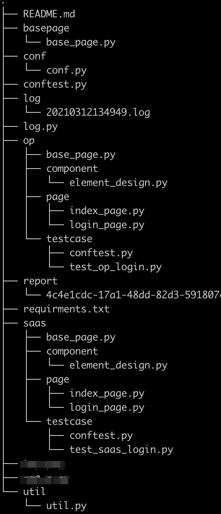
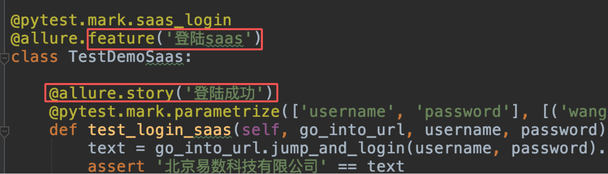

## Framework of web UI

## selenium + pytest + allure + po

### 一、PageObject 设计模式

#### 1、PO模式

PO是Page Object的缩写，PO模式是自动化测试项目开发实践的最佳设计模式之一。
核心思想是通过对界面元素的封装减少冗余代码，同时在后期维护中，若元素定位发生变化， 只
需要调整页面元素封装的代码，提高测试用例的可维护性、可读性。

#### 2、PO模式分层设计

+ BasePage层：存放对网页的一些基础操作并封装成类，BasePage页适用于整个项目

+ 组件层：工具组件类，继承自BasePage类，封装了对各个组件的常用方法

+ 业务page层：一个页面定义成一个page类并继承组件类，调用组件类中的对各个组件的操作方法（也可以直接使用BasePage中封装的方法），实现当前页面的主要业务功能，并按照业务逻辑，在调用的方法中返回其他页面page类

+ case层：调用业务page层封装的方法，按照业务逻辑，调用业务page层封装好的方法编写case（因为在业务层的方法中返回了其他的页面page类）

### 二、方案设计

#### 1、目录层级划分

`basepage/base_page.py`- 实例化webdriver及webdriver的基础操作，公用的操作
 
`op`和`saas` - 两个项目里目录，每个项目目录下，分成以下内容：

+ `base_page` - 存放当前项目的特有basepage类，继承公用的basepage类

+ `component` - 存放组件类文件目录，继承BasePage类，页面组件的工具类

+ `page` - 存放页面page文件的目录

+ `testcase/*` - 存放测试case层，可以按照项目不同，新建不同的文件夹

`util/util.py` - 用于实现一些额外的功能（原生框架不支持的）

`log` - 存放日志文件的目录

`report` - 存放报告数据的目录

`conf` - 配置文件

#### 2、pytest

pytest介绍：<https://blog.csdn.net/lovedingd/article/details/98952868>

1.`fixture` - 初始化测试case或者清除工作 eg: `@pytest.fixture(scope="function", autouse=False)`

a.`scope`被标记方法的作用域，可填写4个参数,与`yield`配合使用，实现与setup和teardown一样的功能
+ `session` 作用于整个session，每个session只运行一次 
+ `module` 作用于整个模块，每个module的所有test只运行一次
+ `class` 作用于整个类，每个class的所有test只运行一次
+ `function` (default)：作用于每个测试方法，每个test都运行一次

b.`fixture`的调用

+ 自动调用：`autouse`缺省为`False`，置为`True`,fixture装饰的函数，会在作用域范围内被自动执行

+ 手动调用：将被fixture装饰的方法名当作函数的传参，传入要调用的函数，当执行到此函数时，fixture会被调用，如果fixture有返回值，返回值会被赋给此处被当做传参的方法名

c.`conftest.py`与`fixture`配合使用

 + 可以跨.py文件调用，有多个.py文件调用时，可让conftest.py只调用了一次fixture，或调用多次fixture
 
 + 不需要import导入 conftest.py，pytest用例会自动识别该文件，放到项目的根目录下就可以全局目录调用了，如果放到某个package下，那就在该package内有效，可有多个conftest.py

#### 3、编写case的一些约定

1.命名规则：
+ 测试文件必须以test_开头
+ 测试类必须以Test开头，且不能有init方法
+ 测试函数或者方法必须以test_开头

2.给测试case打标签，给测试case增加装饰器 `@pytest.mark.markname`,执行case时候，可以通过参数`-m markname`筛选要执行的测试case

3.给测试类增加装饰器`@allure.feature("description")`,测试方法增加装饰器 `@allure.story("description")`，方便在allure报告中展示测试用例

4.为了降低case间的耦合行，每个case都以登陆后的首页作为基准页进行编写

#### 4、新增case的流程及断言

1.以页面page为准，若已有case涉及到的页面page，就在对应页面page类中添加的新方法去实现新的业务逻辑；若无页面page，新建页面page文件，新建页面page类，再在类中新增方法

2.在case层新增测试用例

3.将要断言的数据内容提取并返回到用例层进行断言，暂时使用`assert`关键字进行断言

#### 5、报告展示 - allure

1.本地安装allure command命令行工具，`pip install allure-pytest`安装python库

2.执行测试用例是，增加参数`--alluredir=/path/demo/`，运行case

3.终端执行`allure serve /path/demo/` 会自动调起浏览器展示报告

#### 6、基础设施建设

##### todo

1.basepage通用方法方法封装：（1）切换窗口 （2）切换iframe （3）鼠标事件 （4）键盘事件

2.项目登陆方法实现（op和saas）

3.gio design页面组件方法封装

4.数据库连接

5.XXX
